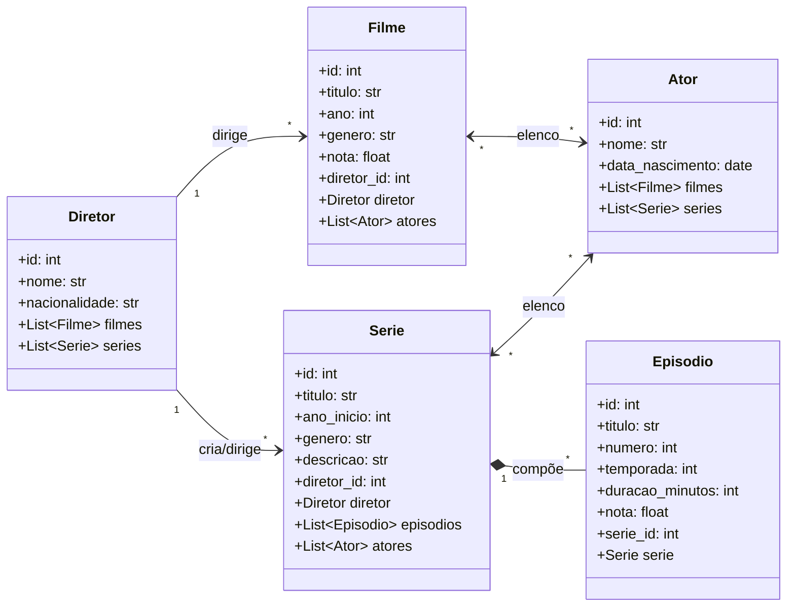
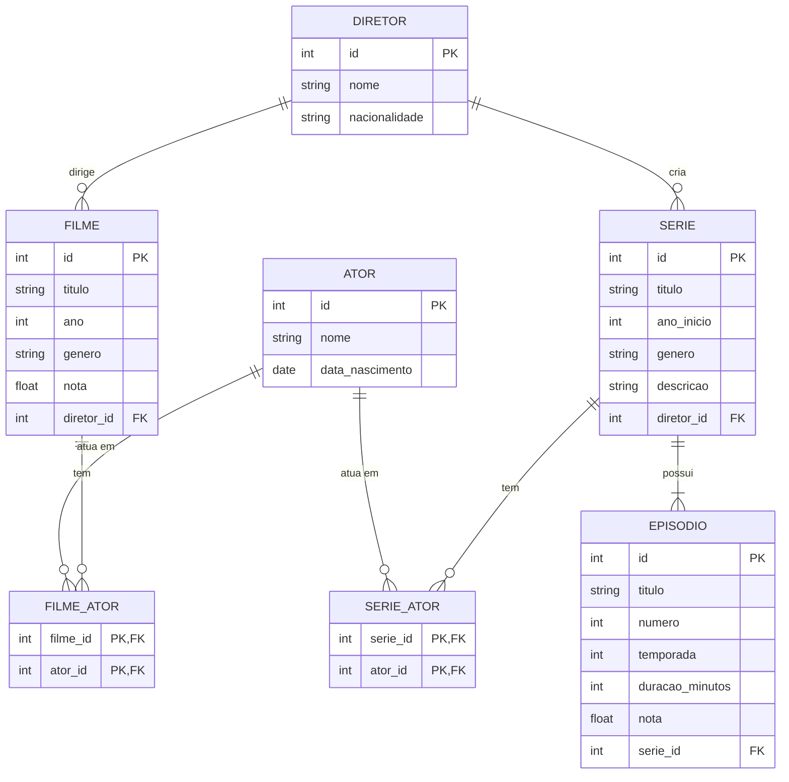

# Diagrama de Classes

```mermaid
classDiagram
    direction LR

    class Diretor {
        +id: int
        +nome: str
        +nacionalidade: str
        +List~Filme~ filmes
        +List~Serie~ series
    }

    class Ator {
        +id: int
        +nome: str
        +data_nascimento: date
        +List~Filme~ filmes
        +List~Serie~ series
    }

    class Filme {
        +id: int
        +titulo: str
        +ano: int
        +genero: str
        +nota: float
        +diretor_id: int
        +Diretor diretor
        +List~Ator~ atores
    }

    class Serie {
        +id: int
        +titulo: str
        +ano_inicio: int
        +genero: str
        +descricao: str
        +diretor_id: int
        +Diretor diretor
        +List~Episodio~ episodios
        +List~Ator~ atores
    }

    class Episodio {
        +id: int
        +titulo: str
        +numero: int
        +temporada: int
        +duracao_minutos: int
        +nota: float
        +serie_id: int
        +Serie serie
    }

    Diretor "1" --> "*" Filme : dirige
    Diretor "1" --> "*" Serie : cria/dirige
    Serie "1" *-- "*" Episodio : compõe

    Filme "*" <--> "*" Ator : elenco
    Serie "*" <--> "*" Ator : elenco
```
# Diagrama ER (Entidade-Relacionamento)

```mermaid
erDiagram
    DIRETOR {
        int id PK
        string nome
        string nacionalidade
    }

    ATOR {
        int id PK
        string nome
        date data_nascimento
    }

    FILME {
        int id PK
        string titulo
        int ano
        string genero
        float nota
        int diretor_id FK
    }

    SERIE {
        int id PK
        string titulo
        int ano_inicio
        string genero
        string descricao
        int diretor_id FK
    }

    EPISODIO {
        int id PK
        string titulo
        int numero
        int temporada
        int duracao_minutos
        float nota
        int serie_id FK
    }

    %% Tabelas Associativas (Link Tables)
    FILME_ATOR {
        int filme_id PK, FK
        int ator_id PK, FK
    }

    SERIE_ATOR {
        int serie_id PK, FK
        int ator_id PK, FK
    }

    %% Relacionamentos
    DIRETOR ||--o{ FILME : "dirige"
    DIRETOR ||--o{ SERIE : "cria"
    SERIE ||--|{ EPISODIO : "possui"
    
    FILME ||--o{ FILME_ATOR : "tem"
    ATOR ||--o{ FILME_ATOR : "atua em"
    
    SERIE ||--o{ SERIE_ATOR : "tem"
    ATOR ||--o{ SERIE_ATOR : "atua em"
```